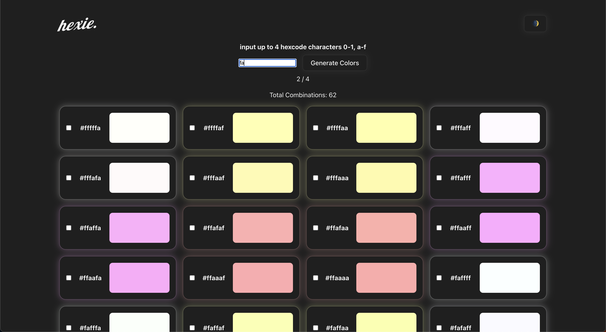

# What is hexie.?

hexie. is a fun color generator that helps designers to find a combination of colors that will support the identity of a brand by generating a hexcode of the color according to the given input.

Try a brand keyword or the initials of an athlete with a jersey number. e.g. fa14 (F1 driver Fernando Alonso 🏎️) or f1, d07, face, etc.

Generated colors include only inputed characters in all possible combinations.

# Learned building this.

- Vue.js data traversing using $emit & props
- TypeScript Fundamentals
- How to use VueUse library

### Screenshot

### Built with

- Vue.js
- Typescript
- CSS
- ChatGPT

### What I learned

I learned how to traverse data between components using $emit and props. During the project i realized that v-bind and v-model are different, i mixed them up until now. 😂
To write a function which generates combinations i used help from ChatGPT. After a few iterations the function finally worked.
I also learned to use vue devtools to debug issues.

## To do next

To continue learning i will fix a few known bugs.

- refactor the code
- extract generate function to separate file
- on saved list update the color of custom name based on contrast.
- add color card preview size option
- limit input to only hexcode characters
